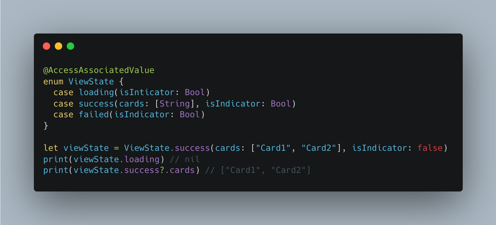

# `@AccessAssociatedValue` Macros



If you expand macros, it'll look like this
```swift
@AccessAssociatedValue
enum ViewState {
  case loading(isInticator: Bool)
  case success(cards: [String], isIndicator: Bool)
  case failed(isIndicator: Bool)

+ var loading: (isIndicator: Bool)? {
+   guard case let .loading(isIndicator) = self else {
+     return nil
+  }
+   return (isIndicator)
+ }
+
+ var success: (cards: [String], isIndicator: Bool)? {
+   guard case let .success(cards, isIndicator) = self else {
+     return nil
+   }
+   return (cards: cards, isIndicator: isIndicator)
+ }
+
+ var failed: (isIndicator: Bool)? {
+   guard case let .failed(isIndicator) = self else {
+     return nil
+   }
+   return (isIndicator)
+ }
}
```
- Easy to access associated value
- Type safe

## How to Use

1. File > Add to Packages
2. Search `https://github.com/coffmark/AccessAssociatedValue`
3. Select `Add to Target`
4. Click `Add Package`

## Contributed

Contributions are always welcome!
